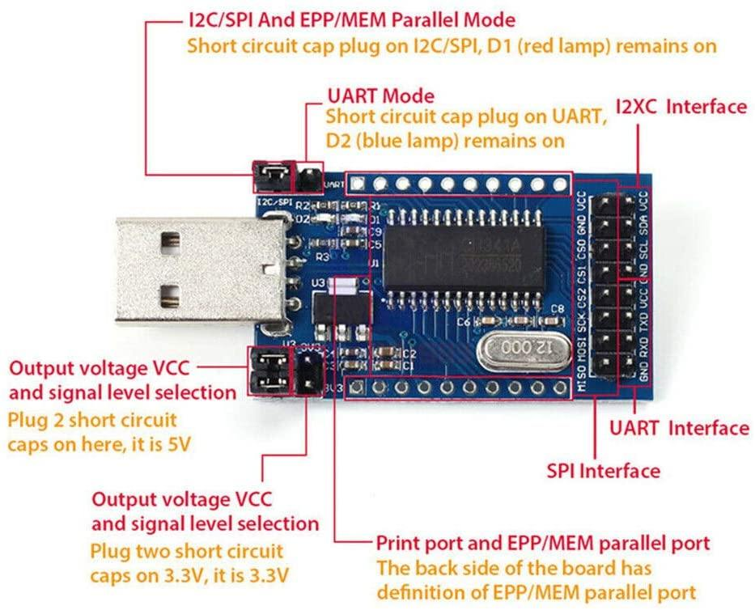

# OpenOCD-CH341A

## Overview

This driver is implementing synchronous bitbang mode of an WCH CH341A, CH341H and similar USB Parallel/SPI bridge ICs by reusing UIO signals as GPIO.



## Usage

#### Compiling openocd:

```
./openocd-patch.sh
./openocd-build.sh
cd openocd-code/
sudo make install
```

#### Connect stm32 with ch341a:

```
${PREFIX}/bin/ch341a-openocd -f ${PREFIX}/share/openocd/scripts/interface/ch341a.cfg -f ${PREFIX}/share/openocd/scripts/target/stm32f1x.cfg
```

## List of connections

#### Default physical pin numbers for CH341A in 28-pin SOP package:

D3(18) - TCK
D0(15) - TMS
D7(22) - TDI
D5(20) - TDO
D1(16) - TRST
D2(17) - SRST

#### Default physical pin numbers for CH341H in 20-pin SSOP package:

DCK(13) - TCK
CS0(10) - TMS
DIN(17) - TDI
DOUT(15) - TDO
CS1(11) - TRST
CS2(12) - SRST

## Commands configure

```
ch341a vid_pid} @var{vid} @var{pid}
```

The vendor ID and product ID of the adapter. If not specified, default 0x1a86:0x5512 is used.

```
ch341a jtag_nums @var{tck} @var{tms} @var{tdi} @var{tdo} @var{trst} @var{srst}
```

Set four JTAG GPIO numbers at once. If not specified, default D3 D0 D7 D5 D1 D2 is used.

```
ch341a tck_num @var{tck}
```

Set TCK GPIO number. If not specified, default D3 is used.

```
ch341a tms_num @var{tms}
```

Set TMS GPIO number. If not specified, default D0 is used.

```
ch341a tdi_num @var{tdi}
```

Set TDI GPIO number. If not specified, default D7 is used.

```
ch341a tdo_num @var{tdo}
```

Set TDO GPIO number. If not specified, default D5 is used.

```
ch341a trst_num @var{trst}
```

Set TRST GPIO number. If not specified, default D1 is used.

```
ch341a srst_num @var{srst}
```

Set SRST GPIO number. If not specified, default D2 is used.

## License

This is free software: you can redistribute it and/or modify it under the terms of the latest GNU General Public License as published by the Free Software Foundation.

This program is distributed in the hope that it will be useful, but WITHOUT ANY WARRANTY; without even the implied warranty of MERCHANTABILITY or FITNESS FOR A PARTICULAR PURPOSE. See the GNU General Public License for more details.

You should have received a copy of the GNU General Public License along with this program. If not, see http://www.gnu.org/licenses/.

